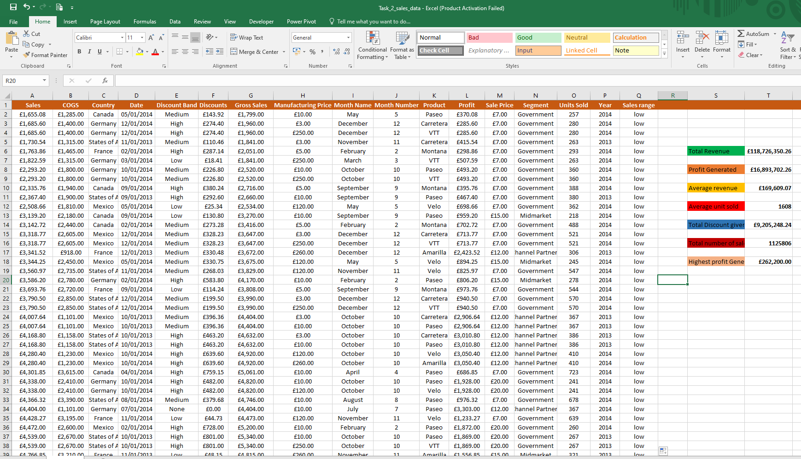

# Rep-1

## Excel training Task 1

**In worksheet 1, create a table with 20 rows of information having the fields below: 
Employee ID
Employee Full Name
Department (Communications, Sales, I.T)
Salary (between $5000 to $25000)
Job type (Part-time, Freelance, Contract)**

I created a table with 20 rows and 5 columns. I entered some ficticious data that I could imagine , making sure they fall within the task given. I made the header distinct by filling it with colour,and I copied the data and pasted on 3 new sheets for subsequent tasks.

## Excel training Task 1b

**In worksheet 1, Show only employees who are ‘Freelancers’ and highlight the ones whose salaries are above $10000
In worksheet 2, split the employees’ full names into first name and last name. Check for duplicates and highlight if any (do not delete)
In worksheet 3, highlight employees whose names begin with the letter ‘E’ (in yellow). Format the Salary column such that the highest SALARY has a green background and the lowest SALARY has a red background.**

To show employees who are freelancers from Sheet 1, I selected all the column, inserted filter from the editing tab.  I selected job type column, with the help of the flter, I was able to show only employees who are freelancers. In order to display the freelancers whose salaries are above £10000, I selected all, clicked on conditional formatting, followed by highlight cell rules, and greater than, I inputed 10000 in the dialog box and OK.

To split the employees names to first and last name and to check for duplicates in Sheet 2, I inserted a new column to the right of the employees name column, by selecting Department column, right click and insert. I selected employee names column, clicked on DATA, TEXT TO COLUMN. On the dialog box I clicked next and selected the delimiter as space, then next and finish. I went ahead to chande the column headers to first name and last name. To highlight duplicates, I went to conditional formatting, clicked on highlight cell rules, followed by duplicate values, then OK.

To highlight the employees whose name started with letter E on Sheet 3, 
I selected the range B2:B21. Then clicked on conditional formatting, New rule under home tab to create a new conditional formatting rule. in the dialog box, under select a rule type section, i clicked on "use a formular to determine which cell to format" i inserted =LEFT(B2,1)="E" into "format values where  this formular is true". i went into format cells dialog box to specify the cell format and clicked OK, and then OK on the new formatting rule dialog box. Finally to highlight the highest and the lowest salary, I selected the salary column, went to conditional formatting > top/bottom Rule > Top ten. In the dialog box, i changed 10 to 1 and chose "green fill with dark green text" to highlight the highest salary . I went through the same process but selected bottom 10 > typed 1 in the dialog box and chose "light red fill with dark red text" to get the lowest salary highlighted in red.

## Excel Training Task 2

**Using the Sales Data, determine the following
The total Revenue and Profit generated
The average Revenue and Units Sold for every order
The total Discount given in £
Total number of sales recorded
The highest Profit generated
Create a column named ‘Sales Range’, return ‘High Sales’ if the Sales value is above average, otherwise, return ‘Low Sales’.**

The first thing I did was to make the headers distinct by filling with colour back ground and bold letter.
I went through each column to assign the right data type by clicking on the drop down under number tab.
I aligned the data to the center by selecting "center" from alignment tab.
On column S, I entered the required deliverable as listed below, giving one space inbetween each requirement down the column.

- Total Revenue

- Total Profit

- Average Revenue

- Average units sold

- Total discount given in £

- Total number of sales recorded.

- The highest profit Generated

I made use of the basic funtions in excel as listed below to arrive at the results. 

# =SUM(A2:A701)

# =SUM(L2:L701)

# =AVERAGE(A2:A701)

# =AVERAGE(O2:O701)

# =SUM(F2:F701)

# =SUM(O2:O701)

# =MAX(L2:L701)

I inserted a new column "Sales range" on the right side of the "year" column.
I used the "IF" statement from the basic functions in excel to return ‘High Sales’ if the Sales value is above average, otherwise, return ‘Low Sales’ as shown below.
# =IF(A2>$T$10,"high","low"

